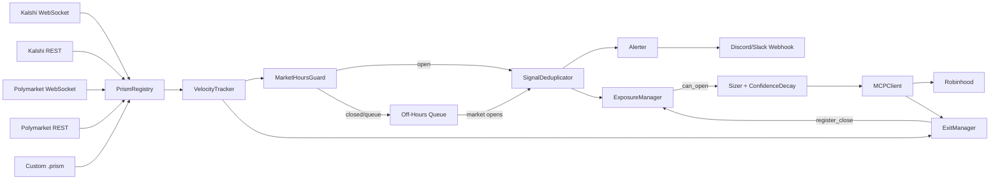

# Robinhood Velocity Signal Engine

[](https://pypi.org/project/prism-signal/)

A prediction market velocity signal engine that fires equity trades when contract implied-probability moves sharply, capturing the latency gap before equity markets reprice the same information.

---

## The Problem

Prediction markets reprice discrete events faster than equity markets. When a contract's implied probability shifts sharply on Kalshi or Polymarket, the correlated equity basket hasn't moved yet — most equity participants don't monitor prediction market flow, and translating a probability shift into an equity order takes time. This engine enters that window and exits before it closes.

---

## The Signal

A signal fires when both conditions hold over the rolling window:

1. `|Δp / Δt| > VELOCITY_THRESHOLD` (default `0.15` probability points per minute)
2. Contract volume spikes relative to recent baseline — filters thin-market noise

Velocity is computed over two windows: 5 minutes (primary) and 15 minutes (confirmation). Price level is irrelevant; only rate of change matters.

---

## Contract to Equity Mapping

Each entry in `data/contract_equity_map.json`:

```json
{
  "KXFED": {
    "description": "Federal Reserve rate decision",
    "direction": "up",
    "basket": ["JPM", "BAC", "WFC", "GS", "MS", "XLF"],
    "sector_etf": "XLF",
    "sector": "financials",
    "confidence": 0.9,
    "exit_hours": 2,
    "exit_adverse_pct": 0.03,
    "macro_factors": ["rates", "credit"]
  }
}
```

`direction` — `"up"` if a probability increase is bullish for the basket, `"down"` if bearish.

`sector` — used by the sector deduplicator. Valid values: `financials`, `utilities`, `energy`, `consumer_staples`, `technology`, `commodities`, `broad_market`.

`macro_factors` — used by ExposureManager. A basket with `["rates", "credit"]` counts toward both factor caps independently. Valid values: `rates`, `inflation`, `energy`, `credit`, `risk_off`.

Mappings are hand-curated and conservative. High-confidence entries (Fed → banks, CPI → TLT/GLD) carry `0.8–1.0`. Speculative linkages carry `0.4–0.7`, which flows directly into reduced position size.

---

## Position Sizing

```
size = portfolio_value * max_position_pct * confidence * min(velocity / threshold, 2.0)
```

- **max_position_pct** — hard cap, default 5% per position
- **confidence** — from the contract map; scales size by how well-understood the relationship is
- **velocity multiplier** — 1.0× at threshold, 2.0× at 2× threshold; capped to guard against thin-market manipulation

---

## Exit Logic

Three independent conditions, checked in order:

1. **Reverse velocity** — immediate exit if the entry contract's velocity crosses `-REVERSE_VELOCITY_THRESHOLD` (default `0.20`)
2. **Time** — exit after `exit_hours` (default 2h); once equity markets have repriced, the edge is gone
3. **Adverse move** — exit on `exit_adverse_pct` drawdown (default 3%)

---

## Signal Deduplication

Two layers run in sequence:

1. **Slug dedup** — suppresses the same contract slug within `DEDUP_WINDOW_MINUTES` (default 30m)
2. **Sector dedup** — caps active signals per sector at `MAX_CONCURRENT_SIGNALS_PER_SECTOR` (default 2); prevents correlated stacking across different slugs in the same sector

---

## Architecture



**Built on Prism** — the connector layer uses the [.prism framework](https://github.com/arpjw/prism) ([`pip install prism-signal`](https://pypi.org/project/prism-signal/)) to wire any time-series source into the engine without modifying core code.

- **PrismRegistry** — loads `.prism` packages at startup, validates auth, wires each into the shared VelocityTracker
- **VelocityTracker** — stateful rolling time-series per contract; the only component with memory of past ticks
- **MarketHoursGuard** — NYSE-aware; drops or queues off-hours signals with edge decay at market open
- **SignalDeduplicator** — slug and sector dedup filter
- **ExposureManager** — enforces macro factor and total notional caps across all open positions
- **Sizer + ConfidenceDecay** — position size formula; confidence adjusted by 7-day price centrality
- **MCPClient** — mock (logs to `logs/mock_orders.jsonl`) or live (Robinhood MCP); identical interface
- **ExitManager** — background loop checking reverse velocity, time, and adverse-move exits
- **Alerter** — fire-and-forget Discord/Slack webhooks; 3s timeout, never blocks signal path

---

## Execution Safety

- **Mock-first default** — `EXECUTION_MODE=mock` logs all orders to `logs/mock_orders.jsonl`; no code path reaches the live endpoint without `EXECUTION_MODE=live`
- **Per-trade cap** — `MAX_POSITION_PCT=0.05` limits any single position to 5% of portfolio
- **Factor exposure caps** — `MAX_FACTOR_EXPOSURE_PCT=0.15` per macro factor, `MAX_TOTAL_EXPOSURE_PCT=0.40` total
- **Isolated account** — live trading scopes to a dedicated agentic account; bugs can't affect a primary account
- **Kill switch** — `MCPClient.cancel_all(strategy_id)` clears the entire position book

---

## V4 Improvements

**LLM Signal Gatekeeper** — `SignalGatekeeper` sits between `SignalDeduplicator` and `Sizer`. Signals above `VELOCITY_THRESHOLD * GATEKEEPER_FAST_PATH_MULTIPLIER` (default 2×) are passed through immediately with no LLM call. Signals in the borderline band (≥ threshold, < 2× threshold) are evaluated by `claude-sonnet-4-6` with adaptive thinking; the model returns `{approved, confidence, reason}`. On any LLM failure the gate defaults to approved so the signal path is never blocked by infrastructure. Every decision (fast or gated) is logged to `logs/gatekeeper.jsonl`. Set `GATEKEEPER_SCALE_POSITION=true` to multiply position size by the model's confidence score on gated approvals.

**Parallel Dual-Source Polling** — `ParallelPoller` runs `KalshiPoller.poll_once` and `PolymarketPoller.poll_once` concurrently via `asyncio.gather`. Errors in either source are isolated — one failure does not suppress signals from the other. Wall-clock and per-source timing are logged to `logs/signals.jsonl` as `type: "poll_timing"` entries.

**Session Memory** — `SessionMemory` in `main.py` tracks signals fired, suppressed, and gatekeeper-approved for the current process lifetime, plus open position count and a rolling tail of closed-trade P&L from `logs/orders.jsonl`. A snapshot is written to `logs/session_state.jsonl` after every signal event. Disable with `SESSION_MEMORY_ENABLED=false`.

---

## V3 Improvements

**Portfolio Exposure Limits** — `ExposureManager` enforces `MAX_FACTOR_EXPOSURE_PCT=0.15` per macro factor and `MAX_TOTAL_EXPOSURE_PCT=0.40` total. Checks run before every order; suppressed orders log a WARNING.

**Market Hours Guard** — `MarketHoursGuard` uses `pandas_market_calendars` for NYSE hours and holidays. `OFF_HOURS_MODE=suppress` (default) drops out-of-hours signals; `=queue` replays at open scaled by `edge_decay_factor = max(0, 1 - hours_to_open / EDGE_HALF_LIFE_HOURS)`.

**Reverse Velocity Exit** — a probability reversal in the entry contract triggers immediate exit before the time stop. Threshold is `REVERSE_VELOCITY_THRESHOLD=0.20` (above the `0.15` entry threshold to filter noise). VelocityTracker is shared between pollers and ExitManager.

**Polymarket WebSocket** — Polymarket poller connects to `wss://ws-subscriptions-clob.polymarket.com/ws/market`, falling back to REST after 5 failures with exponential backoff. Set `POLYMARKET_USE_WEBSOCKET=false` to force REST.

**Sector Deduplication** — `MAX_CONCURRENT_SIGNALS_PER_SECTOR=2` caps active signals per sector within the dedup window. Runs after slug dedup. Disable with `SECTOR_DEDUP_ENABLED=false`.

---

## V2 Improvements

**WebSocket Streaming** — Kalshi poller connects to `wss://api.elections.kalshi.com/trade-api/v2/ws/v2`. Falls back to REST after 5 failed attempts with exponential backoff. Set `KALSHI_USE_WEBSOCKET=false` to force REST.

**Alerting** — `ALERT_WEBHOOK_URL` accepts a Discord or Slack webhook. Discord gets rich embeds; Slack gets plain JSON. All calls are fire-and-forget with a 3s timeout. Disable with `ALERTS_ENABLED=false`.

**Slippage and Fill Modeling** — `backtest/simulate.py` models entry/exit slippage, spread, and latency. `--realistic` sets 10 bps slippage, 5s latency, 5 bps spread (30 bps round-trip). `--optimistic` sets all to zero.

**Confidence Decay** — sizing adjusts confidence by 7-day price centrality: 0.5× at the 7-day extreme, 1.0× at midpoint. Disable with `CONFIDENCE_DECAY_ENABLED=false`.

**Live Dashboard** — `scripts/dashboard.py` renders a rich terminal view from `logs/orders.jsonl`, refreshing every 5 seconds with summary metrics, win rates, open positions with unrealized P&L, and recent activity.

---

## Oracle

The Oracle is a continuous signal evaluation system that runs alongside the engine. It reads `logs/signals.jsonl` and `logs/orders.jsonl`, computes per-connector quality metrics (IC, Sharpe, win rate), detects the current macro regime, tunes velocity thresholds, and publishes connector reputation scores to `oracle/output/`. It never writes to `logs/` and never blocks the signal pipeline.

```bash
python scripts/run_oracle.py run --once     # single evaluation pass
python scripts/run_oracle.py run            # continuous (every 5 minutes)
python scripts/run_oracle.py report         # print current scores to terminal
```

### Output Files

| File | Description | Updated by |
|------|-------------|------------|
| `oracle/output/scores.json` | Reputation score (0–100) per connector | `OracleRunner.run_once` |
| `oracle/output/ic_report.json` | Information coefficient per connector | `OracleRunner.run_once` |
| `oracle/output/decay_curves.json` | Signal decay curves per connector | `OracleRunner.run_once` |
| `oracle/output/thresholds.json` | Recommended velocity thresholds | `OracleRunner.run_once` |
| `oracle/output/regime.json` | Current macro regime and multipliers | `OracleRunner.run_once` |
| `oracle/output/summary.json` | Human-readable run summary | `OracleRunner.run_once` |

### Publishing to Prism Registry

Set `PRISM_GITHUB_TOKEN` to a GitHub PAT with `contents:write` on the `arpjw/prism` repo, then run with `--publish`. The oracle will update `reputation_score`, `reputation_label`, and `scores_updated_at` for each connector in `registry/registry.json`.

---

## Prism Connectors

Drop any `.prism` package into `connectors/custom/` and it loads automatically at startup. Each package declares its auth requirements, contract slugs, and transport in a YAML manifest. The registry validates auth at load time and wires the connector into the shared VelocityTracker.

### Package Structure

```
my_source.prism/
├── connector.prism   # YAML manifest: name, slug, version, transport, auth fields, contract slugs
├── __init__.py       # PrismConnector subclass; implements start/stop/health_check
└── README.md         # Required env vars, normalization notes, contract slug rationale
```

### Developer Commands

```bash
# scaffold a new connector
python -m prism_sdk.scaffold --name "My Source" --slug my_source --type custom --transport rest

# validate without running the engine
python -m prism_sdk.validator --path connectors/my_source.prism

# drop into engine
mv my_source.prism connectors/custom/
python main.py --dry-run
```

### Built-in Connectors

| Name | Slug | Source | Transport | Auth |
|------|------|--------|-----------|------|
| `kalshi_fed.prism` | `kalshi_fed` | Kalshi | WebSocket + REST | `KALSHI_API_KEY`, `KALSHI_PRIVATE_KEY_PATH` |
| `polymarket_macro.prism` | `polymarket_macro` | Polymarket CLOB | WebSocket + REST | Optional `POLYMARKET_API_KEY` |
| `metaculus_macro.prism` | `metaculus_macro` | Metaculus | REST | None |
| `manifold_macro.prism` | `manifold_macro` | Manifold Markets | REST | None |
| `fred_macro.prism` | `fred_macro` | FRED API | REST | `FRED_API_KEY` |

For the full developer guide including manifest field reference and `PrismConnector` interface contract, see [CONTRIBUTING_CONNECTORS.md](CONTRIBUTING_CONNECTORS.md).

---

## Quickstart

```bash
git clone https://github.com/arpjw/robinhood
pip install -r requirements.txt
cp .env.example .env
# Fill in KALSHI_API_KEY, KALSHI_PRIVATE_KEY_PATH, and other vars
python scripts/healthcheck.py
python main.py --dry-run

# Monitor mock performance in a separate terminal:
python scripts/dashboard.py
```

`scripts/healthcheck.py` validates credentials, API reachability, and contract map loading. `--dry-run` exits after the first signal fires.

---

## Environment Variables

| Variable | Description | Default |
|---|---|---|
| `KALSHI_API_KEY` | RSA key ID from Kalshi dashboard | required |
| `KALSHI_PRIVATE_KEY_PATH` | Path to RSA private key PEM file | required |
| `KALSHI_TICKERS` | Comma-separated tickers to track | all from contract map |
| `KALSHI_DEBUG_AUTH` | Print RSA-PSS auth debug info | `0` |
| `POLYMARKET_API_KEY` | Polymarket API key | optional |
| `POLYMARKET_ADDRESS` | Polymarket wallet address for CLOB auth | optional |
| `POLYMARKET_CONDITION_IDS` | Comma-separated condition IDs to track | optional |
| `EXECUTION_MODE` | `mock` or `live` | `mock` |
| `ROBINHOOD_MCP_URL` | Robinhood MCP endpoint | `https://agent.robinhood.com/mcp/trading` |
| `VELOCITY_THRESHOLD` | Minimum Δp/Δt to fire a signal | `0.15` |
| `VELOCITY_WINDOW_MINUTES` | Primary rolling window | `5` |
| `DEDUP_WINDOW_MINUTES` | Duplicate suppression window | `30` |
| `POLL_INTERVAL_SECONDS` | REST polling interval | `30` |
| `EXIT_CHECK_INTERVAL_SECONDS` | Exit manager check interval | `60` |
| `PORTFOLIO_VALUE` | Capital base for position sizing | `10000` |
| `MAX_POSITION_PCT` | Max allocation per position | `0.05` |
| `KALSHI_USE_WEBSOCKET` | Use WebSocket; false forces REST | `true` |
| `ALERT_WEBHOOK_URL` | Discord or Slack webhook URL | `""` |
| `ALERTS_ENABLED` | Enable webhook alerting | `true` |
| `BACKTEST_SLIPPAGE_BPS` | Entry/exit slippage per side | `10` |
| `BACKTEST_LATENCY_SECONDS` | Signal-to-fill timestamp offset | `5` |
| `BACKTEST_SPREAD_BPS` | One-way spread cost | `5` |
| `CONFIDENCE_DECAY_ENABLED` | Adjust confidence by 7-day centrality | `true` |
| `MAX_FACTOR_EXPOSURE_PCT` | Max notional in any single macro factor | `0.15` |
| `MAX_TOTAL_EXPOSURE_PCT` | Max gross notional across all positions | `0.40` |
| `OFF_HOURS_MODE` | `suppress` or `queue` for out-of-hours signals | `suppress` |
| `EDGE_HALF_LIFE_HOURS` | Hours to open at which off-hours signal has zero edge | `1.0` |
| `REVERSE_VELOCITY_THRESHOLD` | Reverse velocity magnitude to trigger exit | `0.20` |
| `REVERSE_VELOCITY_ENABLED` | Enable reverse velocity exits | `true` |
| `POLYMARKET_USE_WEBSOCKET` | Use WebSocket for Polymarket | `true` |
| `MAX_CONCURRENT_SIGNALS_PER_SECTOR` | Active signal cap per sector | `2` |
| `SECTOR_DEDUP_ENABLED` | Enable sector-based deduplication | `true` |
| `ANTHROPIC_API_KEY` | Anthropic API key for gatekeeper LLM calls | required if `GATEKEEPER_ENABLED=true` |
| `GATEKEEPER_ENABLED` | Enable LLM-based borderline signal filter | `true` |
| `GATEKEEPER_FAST_PATH_MULTIPLIER` | Velocity ≥ threshold × multiplier bypasses LLM | `2.0` |
| `GATEKEEPER_SCALE_POSITION` | Scale position size by gatekeeper confidence | `false` |
| `GATEKEEPER_LOG_PATH` | JSONL log for gatekeeper decisions | `logs/gatekeeper.jsonl` |
| `SESSION_MEMORY_ENABLED` | Write rolling session snapshots to JSONL | `true` |
| `SESSION_STATE_LOG_PATH` | Session snapshot log path | `logs/session_state.jsonl` |

---

## Project Structure

```
signals/
  kalshi_poller.py       # Kalshi WebSocket + REST fallback with RSA-PSS auth
  polymarket_poller.py   # Polymarket WebSocket + REST fallback
  parallel_poller.py     # Concurrent Kalshi + Polymarket polling via asyncio.gather
  velocity.py            # Δp/Δt computation and threshold filtering
  contract_mapper.py     # contract to equity basket lookup
  deduplicator.py        # slug and sector-based duplicate suppression
  gatekeeper.py          # LLM-based borderline signal filter (fast path + gated path)
  confidence_decay.py    # 7-day centrality-based confidence adjustment
  market_hours.py        # NYSE hours guard, off-hours queue, edge decay
execution/
  mcp_client.py          # Mock and Live MCP client implementations
  order_schema.py        # Typed OrderRecord dataclass and log I/O
  sizer.py               # Velocity-weighted position sizing with confidence decay
  exit_manager.py        # Time, adverse-move, and reverse velocity exits
  exposure_manager.py    # Macro factor exposure limits and position tracking
connectors/
  kalshi_fed.prism/      # Kalshi Fed rate decision connector
  polymarket_macro.prism/ # Polymarket macro connector
  metaculus_macro.prism/  # Metaculus connector
  manifold_macro.prism/   # Manifold Markets connector
  fred_macro.prism/       # FRED economic data connector (normalized via rolling 52-week min-max)
  custom/                 # Drop user .prism connectors here; loaded after built-ins
prism_sdk/
  scaffold.py            # Connector skeleton generator
  validator.py           # Connector validation tool (manifest, imports, slug, contract slugs)
backtest/
  simulate.py            # Historical signal replay with slippage/fill modeling
scripts/
  dashboard.py           # Rich terminal dashboard for live P&L monitoring
  fetch_kalshi_history.py  # Fetch historical candlestick data from Kalshi
  discover_mcp_tools.py    # List available Robinhood MCP tools
  healthcheck.py           # Pre-flight system check
applog/
  logger.py              # Centralized structured logging to JSONL
  alerter.py             # Discord/Slack webhook notifications
data/
  contract_equity_map.json  # Hand-curated contract to equity mapping
logs/                    # Runtime logs (signals.jsonl, orders.jsonl, errors.jsonl)
main.py                  # Production entrypoint
```

---

## Development Status

- **Phase 0** (signal engine): complete
- **Phase 1** (mock execution and backtest): complete
- **Phase 2** (live MCP): implemented; awaiting Robinhood agentic trading beta access
- **Phase 3** (exposure limits, market hours, reverse velocity): complete

Live execution requires `EXECUTION_MODE=live` and a valid `ROBINHOOD_MCP_URL`. Run `python scripts/healthcheck.py` before every live session.
