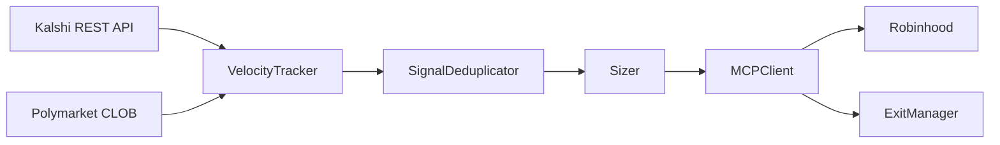

# Robinhood Velocity Signal Engine

Captures the latency gap between prediction market repricing and equity market repricing by firing trades when contract implied-probability velocity exceeds a threshold.

## How It Works

Prediction market crowds (Kalshi, Polymarket) reprice discrete events like Fed decisions, CPI prints, and election outcomes faster than equity markets. When a contract's implied probability shifts sharply, the correlated equity basket hasn't fully repriced yet. This engine detects those velocity spikes and submits market orders via the Robinhood Agentic Trading MCP before the gap closes. Positions are exited by time decay (default 2 hours) or adverse price move (default 3%), whichever triggers first.

## Architecture



## Quickstart

```bash
git clone https://github.com/arpjw/robinhood
pip install -r requirements.txt
cp .env.example .env
# Fill in KALSHI_API_KEY, KALSHI_PRIVATE_KEY_PATH, and other vars
python scripts/healthcheck.py
python main.py --dry-run
```

## Environment Variables

| Variable | Description | Default |
|---|---|---|
| `KALSHI_API_KEY` | RSA key ID from Kalshi dashboard | required |
| `KALSHI_PRIVATE_KEY_PATH` | Path to RSA private key PEM file | required |
| `KALSHI_TICKERS` | Comma-separated Kalshi market tickers to track | all from contract map |
| `KALSHI_DEBUG_AUTH` | Print auth debug info on each request | `0` |
| `POLYMARKET_API_KEY` | Polymarket API key | required |
| `POLYMARKET_ADDRESS` | Polymarket wallet address | required |
| `POLYMARKET_CONDITION_IDS` | Comma-separated Polymarket condition IDs to track | required |
| `EXECUTION_MODE` | `mock` or `live` | `mock` |
| `ROBINHOOD_MCP_URL` | Robinhood MCP endpoint (required for live) | `https://agent.robinhood.com/mcp/trading` |
| `VELOCITY_THRESHOLD` | Minimum Δp/Δt to fire signal | `0.15` |
| `VELOCITY_WINDOW_MINUTES` | Rolling window for velocity computation | `5` |
| `DEDUP_WINDOW_MINUTES` | Suppression window for duplicate signals | `30` |
| `POLL_INTERVAL_SECONDS` | Polling interval | `30` |
| `EXIT_CHECK_INTERVAL_SECONDS` | Exit check interval | `60` |
| `PORTFOLIO_VALUE` | Total portfolio value in USD | `10000` |
| `MAX_POSITION_PCT` | Max allocation per position | `0.05` |

## Project Structure

```
signals/
  kalshi_poller.py       # Kalshi REST polling with RSA-PSS auth
  polymarket_poller.py   # Polymarket CLOB polling
  velocity.py            # Δp/Δt computation and threshold filtering
  contract_mapper.py     # contract → equity basket lookup
  deduplicator.py        # cross-source duplicate suppression
execution/
  mcp_client.py          # Mock and Live MCP client implementations
  order_schema.py        # Typed OrderRecord dataclass + log I/O
  sizer.py               # Velocity-weighted position sizing
  exit_manager.py        # Time-decay and adverse-move exit logic
backtest/
  simulate.py            # Historical signal replay with P&L analysis
scripts/
  fetch_kalshi_history.py  # Fetch historical candlestick data
  discover_mcp_tools.py    # List available Robinhood MCP tools
  healthcheck.py           # Pre-flight system check
applog/
  logger.py              # Centralized structured logging
data/
  contract_equity_map.json  # Hand-curated contract → equity mapping
logs/                    # Runtime logs (signals.jsonl, orders.jsonl, errors.jsonl)
main.py                  # Production entrypoint
```

## Development Status

- **Phase 0** (signal engine): complete
- **Phase 1** (mock execution + backtest): complete
- **Phase 2** (live MCP): implemented, awaiting Robinhood agentic trading access (currently in private beta)

Live execution requires a Robinhood agentic trading account. Set `EXECUTION_MODE=live` and `ROBINHOOD_MCP_URL` only after receiving beta access. Run `python scripts/healthcheck.py` before every live session.
