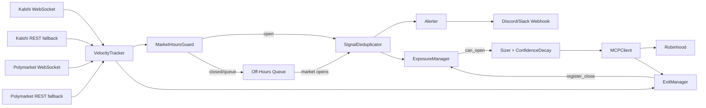

# Robinhood Velocity Signal Engine

[](https://pypi.org/project/prism-signal/)

A prediction market velocity signal engine that fires equity trades when contract implied-probability moves sharply, capturing the latency gap before equity markets reprice the same information.

---

## The Problem

Prediction markets and equity markets both price the same underlying reality, but they do so through different mechanisms and at different speeds. Prediction markets like Kalshi and Polymarket aggregate the beliefs of participants who have direct financial skin in the game on specific binary outcomes. Equity markets aggregate the beliefs of a much broader participant base through continuous price discovery, analyst coverage, news flow, and algorithmic trading.

When a discrete event probability shifts sharply in a prediction market, the correlated equity basket typically has not yet repriced to reflect that same information. This latency gap exists for a few structural reasons:

**Information routing.** Most equity traders and equity-focused algorithms do not monitor prediction market order flow. The information is public, but it is not wired into the standard data feeds that drive equity pricing. A sudden shift in the Fed funds rate cut contract on Kalshi does not automatically propagate to the options desk pricing bank stocks.

**Participant overlap.** The set of participants active on Kalshi or Polymarket and the set active in XLF or TLT have limited overlap. Prediction market participants are often more focused on the discrete event itself, while equity participants are pricing a continuous stream of macro variables. The arbitrage between the two requires someone to be watching both simultaneously.

**Reaction time.** Even when an equity participant notices a prediction market move, translating that into a position takes time. They need to assess the magnitude of the move, determine the correct equity expression, size the position, and submit an order. This sequence takes minutes, and in some cases longer.

The result is a window where the prediction market has priced new information into a binary contract but the correlated equity basket has not yet moved. This engine is designed to enter that window and exit before it closes.

---

## The Signal

### Velocity as the Core Concept

A prediction market contract sitting at 70% implied probability is not actionable by itself. That probability could have been 70% for a week, fully digested and already priced into equities. What matters is not the level of the probability but the rate at which it is changing.

Velocity is defined as the change in implied probability over a time window:

```
velocity = Δp / Δt
```

A contract moving from 52% to 68% in five minutes has a velocity of 3.2 percentage points per minute. That same 16-point move over two hours has a velocity of 0.13 points per minute. The first represents new information arriving rapidly. The second likely represents slow drift as participants gradually update their priors. Only the first is worth trading.

### Why Velocity Alone is Not Enough

Raw velocity can be triggered by a single large order in a thin market. A contract with minimal open interest can show extreme velocity from a single participant moving the market with no real information content behind it. Volume confirmation is required as a second condition.

A signal fires only when both conditions hold simultaneously:

1. Absolute velocity exceeds the configured threshold over the rolling window.
2. Contract volume shows a meaningful spike relative to recent baseline.

The volume check filters out thin-market noise and ensures the velocity is driven by a crowd of participants reacting to information, not a single actor moving a stale contract.

### The 0.15 Threshold

The default velocity threshold of 0.15 means a contract must move at least 15 percentage points per minute (sustained over the rolling window) for a signal to fire. Intuitively, this corresponds to something like a contract on a scheduled Fed decision moving from 40% to 55% in the first minute after a leak or early data release. That is a large and fast move that is unlikely to be noise.

Thresholds much lower than this generate frequent false positives from routine market fluctuations. Thresholds much higher than this miss real signals that diffuse slightly more gradually. 0.15 is empirically calibrated against Kalshi historical data and is configurable via environment variable.

### Rolling Windows

Velocity is computed over two rolling windows: 5 minutes (primary) and 15 minutes (secondary). The 5-minute window catches sharp initial moves. The 15-minute window confirms that the move is sustained rather than an instantaneous spike that immediately reversed. Both windows use the same threshold.

### What a Signal Means in Plain Terms

When this engine fires a signal, the interpretation is: prediction market participants have received or inferred new information about a specific event and have moved the contract price fast enough and with enough volume that it is unlikely to be noise. The correlated equity basket, per the contract mapper, has not yet priced this information. There is a window to enter before it does.

---

## Contract to Equity Mapping

### Schema

Each entry in `data/contract_equity_map.json` follows this structure:

```json
{
  "KXFED": {
    "description": "Federal Reserve rate decision",
    "direction": "up",
    "basket": ["JPM", "BAC", "WFC", "GS", "MS", "XLF"],
    "sector_etf": "XLF",
    "sector": "financials",
    "confidence": 0.9,
    "exit_hours": 2,
    "exit_adverse_pct": 0.03,
    "macro_factors": ["rates", "credit"]
  }
}
```

`direction` specifies whether a probability increase is bullish (`"up"`) or bearish (`"down"`) for the basket.

`sector` is used by the sector deduplicator. Valid values: `financials`, `utilities`, `energy`, `consumer_staples`, `technology`, `commodities`, `broad_market`.

`macro_factors` is used by the ExposureManager to track correlated risk. A basket exposed to `["rates", "credit"]` counts toward both factors when checking exposure caps. Valid values: `rates`, `inflation`, `energy`, `credit`, `risk_off`.

### Mapping Philosophy

Every prediction market contract that this engine can trade on must have a corresponding entry in `data/contract_equity_map.json`. This is a hand-curated mapping that specifies which equities or ETFs are correlated with a given contract, in which direction, and with how much confidence.

The mapping is intentionally conservative. It is better to miss a signal than to trade on a poorly understood relationship. The initial set of mappings covers high-confidence, well-established macro relationships where the causal link between the prediction market event and the equity basket is economically obvious.

### High-Confidence Mappings

Some mappings are mechanically straightforward. A Fed rate decision directly affects bank profitability and borrowing costs, which means XLF and individual bank stocks are predictably correlated. A CPI print that surprises to the upside is bearish for long-duration bonds and bullish for inflation hedges like gold. These relationships are durable, widely understood, and have large liquid equity expressions. Confidence values for these mappings are set at 0.8 to 1.0.

### Lower-Confidence Mappings

Other mappings involve more assumptions. A geopolitical event might affect oil prices, which might affect energy sector equities, but the transmission is less direct and the relationship is more context-dependent. These mappings carry confidence values in the 0.4 to 0.7 range, which directly reduces position size through the sizer formula.

### Direction

The direction field specifies whether a probability increase is bullish or bearish for the equity basket. This is not always the same direction. A contract on "Fed cuts rates at next meeting" increasing in probability is bullish for rate-sensitive equities like utilities and REITs. A contract on "recession probability over 50%" increasing in probability is bearish for cyclical equities. The direction field encodes this so the engine knows whether to submit a buy or sell order.

---

## Position Sizing

Position size is computed with the following formula:

```
size = portfolio_value * max_position_pct * confidence * min(velocity / threshold, 2.0)
```

Each term serves a specific purpose.

**portfolio_value** is the total capital base. This anchors sizing to the actual risk pool rather than a fixed dollar amount that drifts out of calibration as the portfolio grows or shrinks.

**max_position_pct** is a hard cap, defaulting to 5%. No single position can exceed 5% of the portfolio regardless of signal strength. This prevents any single trade from being catastrophic if the mapping is wrong or the signal does not translate to equity movement.

**confidence** comes directly from the contract equity map and scales position size proportionally to how well-understood the relationship is. A high-confidence Fed to banks mapping at 0.9 confidence uses 90% of the max position. A speculative mapping at 0.5 confidence uses half. This is the mechanism by which mapping uncertainty flows into risk management without requiring a separate override system.

**min(velocity / threshold, 2.0)** is the velocity multiplier. A signal that fires exactly at the threshold gets a 1.0 multiplier (base size). A signal at twice the threshold gets a 2.0 multiplier (double size). The 2.0 cap exists for two reasons. First, extreme velocity can indicate data error or thin-market manipulation rather than genuine information, and uncapped sizing on a garbage signal is a meaningful risk. Second, even if the signal is real, extremely fast moves may already be partially arbitraged away by the time an order is submitted, reducing the expected edge.

---

## Exit Logic

### Why Time-Based Exits

Most systematic strategies use price-based exits as the primary mechanism. This engine uses time as the primary exit signal, with price as a secondary stop.

The reasoning is specific to the thesis. The edge in this strategy comes from the information diffusion lag between prediction markets and equity markets. Once the equity market has repriced the information, the edge is gone regardless of whether the position is profitable or at a loss. Holding beyond that point is no longer a prediction market velocity trade; it is just a directional equity position with no systematic edge backing it.

Time is used as a proxy for information diffusion. After two hours, it is reasonable to assume that a macro event priced into a prediction market has propagated to equity market participants through news coverage, analyst commentary, and momentum following. The engine exits not because of where the price is, but because the original reason for being in the trade has expired.

### The Two-Hour Default

Two hours is calibrated to typical equity market reaction times for macro events. Fed decisions, CPI prints, and similar scheduled events tend to fully propagate through equity markets within one to three hours depending on the magnitude of the surprise. Two hours represents a middle estimate that errs slightly toward staying in the trade while the diffusion is still happening.

This is configurable per contract category in `data/contract_equity_map.json`, since some event types diffuse faster than others. A highly liquid event like a Fed decision may fully reprice in 30 to 60 minutes. A more obscure political event may take longer.

### The 3% Adverse Move Stop

The price-based stop at 3% adverse move protects against the case where the mapping was wrong, the signal was noise, or the equity market moved in an unexpected direction for unrelated reasons. It is not the primary exit mechanism; it is a safety valve. If the equity basket moves 3% against the position before the two-hour window closes, something unexpected is happening and the position is closed.

---

## Signal Deduplication

Kalshi and Polymarket can have correlated markets covering the same underlying event. A major election outcome, for example, might have nearly identical contracts on both platforms. If both contracts show velocity spikes in response to the same news, the engine would see two signals and potentially enter the same equity basket twice, doubling unintended exposure.

The deduplicator tracks which contract-to-equity-basket pairs have recently produced signals and suppresses duplicates within a configurable window, defaulting to 30 minutes. If a signal fires on a Fed contract mapped to XLF, any subsequent signal on a different contract that also maps to XLF is suppressed for the next 30 minutes.

The deduplication key is the equity basket, not the contract. Two different contracts mapping to the same basket are treated as duplicates because the equity exposure is identical regardless of which prediction market surface produced the signal.

---

## Architecture



**Kalshi poller** connects via WebSocket first (`KALSHI_USE_WEBSOCKET=true` by default), falling back to REST polling after 5 failed connection attempts. The WebSocket feed delivers real-time ticker updates without polling overhead, which reduces the latency between a contract price move and the signal firing.

**Alerter** fires fire-and-forget webhook notifications (Discord or Slack) when signals, orders, and exits occur. It runs as an async task with a 3-second timeout and never blocks signal processing.

**Confidence decay** adjusts the static confidence value from the contract map based on how central the current price is within its 7-day range. A contract trading near its 7-day extreme gets half the base confidence; a contract near its midpoint gets full confidence. This reduces position size when information may already be priced in.

**Kalshi poller and Polymarket poller** are separate modules because the two APIs have different authentication schemes, rate limits, data formats, and WebSocket semantics. Keeping them separate means a change to one does not risk breaking the other, and either can be disabled independently.

**VelocityTracker** is stateful. It maintains a rolling time-series of price observations per contract and computes velocity over configurable windows. It is the only component with memory of past ticks; everything else is stateless per signal.

**SignalDeduplicator** sits between the tracker and the rest of the pipeline. It is a pure filter: signals go in, a subset comes out. It maintains a suppression table keyed by equity basket with expiry timestamps.

**Sizer** is a pure function. Given a signal and the current portfolio state, it returns a position size in dollars. It has no side effects and no internal state, which makes it straightforward to test and to audit.

**MCPClient** is the only component that touches external execution infrastructure. In mock mode it writes to a local log file. In live mode it calls the Robinhood Agentic Trading MCP endpoint. The interface is identical in both modes, which means the rest of the pipeline does not need to know which mode is active.

**ExitManager** runs as a background loop, polling open positions and checking exit conditions. It is separate from the signal entry path to avoid coupling entry logic to exit logic and to allow exit checks to run on a different interval than the signal polling cycle.

---

## Execution Safety

### Isolated Account

Live trading uses a dedicated Robinhood agentic trading account that is separate from any personal brokerage account. The MCP endpoint scopes permissions to this isolated account, which means a bug in the sizing or mapping logic cannot affect holdings in a primary account.

### Mock-First Default

`EXECUTION_MODE` defaults to `mock`. In mock mode, every order that would be submitted to Robinhood is instead written to `logs/mock_orders.jsonl` with full metadata including ticker, side, size, strategy ID, signal source, and timestamp. The pipeline runs exactly as it would in live mode, including position tracking and exit management, but no orders are sent to a broker.

This means the default behavior of running the engine without any configuration is to log what it would have done, not to trade. Switching to live mode requires explicitly setting `EXECUTION_MODE=live` in the environment. There is no code path that reaches the live MCP endpoint without that variable being set.

### Kill Switch

`MCPClient.cancel_all(strategy_id)` submits cancellation requests for all open orders associated with this engine's strategy ID. In an emergency, calling this once clears the entire position book. The strategy ID also prevents interference with any other automated systems that might be sharing the same account.

### Layered Safety Model

The safety model has four independent layers. First, mock mode is the default and live mode must be explicitly opted into. Second, position sizes are capped per trade at `max_position_pct` of portfolio value. Third, the isolated account limits blast radius at the account level. Fourth, the exit manager enforces time and price stops even if the entry logic produced an oversized or misdirected position. Each layer operates independently so a failure in one does not disable the others.

---

## V3 Improvements

### Portfolio Exposure Limits (Risk Critical)

Individual position caps (5% per trade) prevent any single position from being oversized, but they do not prevent correlated signals from stacking into a concentrated macro bet. If three signals all map to rate-sensitive equities and all fire within a 30-minute window, the engine could end up with 15% of the portfolio in the same macro factor even though each individual position was within limits.

`execution/exposure_manager.py` enforces aggregate portfolio exposure limits by macro factor. Each contract in `data/contract_equity_map.json` carries a `macro_factors` list identifying which macro themes the basket is exposed to (e.g., `["rates", "credit"]`). ExposureManager tracks running notional per factor across all open positions and blocks any new order that would breach a factor cap.

`MAX_FACTOR_EXPOSURE_PCT=0.15` caps any single macro factor at 15% of portfolio value. `MAX_TOTAL_EXPOSURE_PCT=0.40` caps total notional across all positions at 40% regardless of factors. Both are checked before any order is submitted. Suppressed orders log a WARNING with the reason but do not fire an alert; exposure suppression is a normal operating condition, not an error.

### Market Hours Awareness

Prediction markets run 24/7. Equity markets do not. A contract that spikes at 2am ET is a real signal, but the equity expression cannot be executed until 9:30am. By then, the information has likely fully diffused and the edge is gone.

`signals/market_hours.py` implements a `MarketHoursGuard` class that is aware of NYSE trading hours and holidays using the `pandas_market_calendars` library. Pre-market (before 9:30am ET) and post-market (after 4:00pm ET) are treated identically to closed.

`OFF_HOURS_MODE=suppress` (default) drops any signal that fires outside market hours and logs the contract, velocity, and minutes until open.

`OFF_HOURS_MODE=queue` stores off-hours signals in memory and replays them at market open. Replay multiplies the position size by `edge_decay_factor(signal_timestamp)`: a signal that fired 30 minutes before open gets approximately 0.5x size (half the edge remains), and a signal that fired 6+ hours before open has 0.0 decay and is dropped at replay time. The decay model: `max(0.0, 1.0 - hours_to_open / EDGE_HALF_LIFE_HOURS)`.

### Reverse Velocity Exit

The thesis is symmetric. If a sharp probability increase was the reason to enter, a sharp probability decrease in the same contract is new information that the initial signal was wrong. Waiting for the 2-hour time stop is too slow in this case — the information content of the reversal is the exit signal.

`REVERSE_VELOCITY_THRESHOLD=0.20` (slightly higher than the entry threshold of 0.15 to filter noise) triggers an immediate exit when the current velocity for the entry contract is opposite in sign to the entry velocity and its magnitude exceeds the threshold. The ExitManager checks this condition on every loop cycle, before the time and price checks. Exits via reverse velocity log a WARNING with entry velocity, current velocity, and hold time — these are the most informative events for calibrating whether the entry threshold is set correctly.

The `VelocityTracker` instance is shared between `KalshiPoller` and `ExitManager` rather than constructing separate trackers, so the ExitManager always sees the most recent computed velocity from live market data.

### Polymarket WebSocket

`signals/polymarket_poller.py` now connects to `wss://ws-subscriptions-clob.polymarket.com/ws/market` via WebSocket and streams `price_change` events in real time, replacing REST polling for primary data delivery. The same resilience pattern as the Kalshi poller: exponential backoff (1s, 2s, 4s, 8s, 16s) on connection failure, fall back to REST polling after 5 consecutive failures with a WARNING log. Set `POLYMARKET_USE_WEBSOCKET=false` to force REST mode.

### Correlation-Aware Deduplication

The existing deduplicator suppresses exact-slug duplicates within the DEDUP_WINDOW_MINUTES window, but it misses the case where two different contracts map to the same sector. XLF and JPM are in the same `financials` sector, and two signals that both map to financials create correlated exposure even though they pass the slug deduplication check.

`MAX_CONCURRENT_SIGNALS_PER_SECTOR=2` caps the number of active signals per sector within the dedup window. Each contract in `data/contract_equity_map.json` now carries a `sector` field (`financials`, `utilities`, `energy`, `consumer_staples`, `technology`, `commodities`, `broad_market`). If a new signal's sector already has the maximum number of active signals, the new signal is suppressed with a WARNING logging the sector, the active slugs, and the suppressed slug. Slug deduplication runs first and independently. Set `SECTOR_DEDUP_ENABLED=false` to disable sector dedup while keeping slug dedup active.

---

## V2 Improvements

### WebSocket Streaming

The Kalshi poller now connects via WebSocket (`wss://api.elections.kalshi.com/trade-api/v2/ws/v2`) and streams ticker updates in real time instead of polling every 30 seconds. This tightens the critical latency path between a contract repricing and the signal firing. If the WebSocket connection fails 5 times with exponential backoff (1s, 2s, 4s, 8s, 16s), the engine logs a warning and falls back to REST polling automatically. Set `KALSHI_USE_WEBSOCKET=false` to force REST mode for debugging.

### Alerting

Add `ALERT_WEBHOOK_URL` pointing to a Discord or Slack incoming webhook. When set, the engine sends structured notifications on signal fires, order submissions, and exit events. Discord URLs get rich embed payloads with color-coded severity. Slack URLs get plain JSON compatible with incoming webhooks. All webhook calls are fire-and-forget with a 3-second timeout so a slow webhook never blocks signal processing. Disable with `ALERTS_ENABLED=false`.

### Slippage and Fill Modeling

`backtest/simulate.py` now models realistic execution costs. Entry and exit prices reflect slippage, spread costs, and execution latency. Run with `--realistic` (10 bps slippage, 5s latency, 5 bps spread, 30 bps total round-trip) or `--optimistic` (all costs zero) to compare. The backtest JSON output includes an `execution_assumptions` section listing exact cost parameters used.

### Live Performance Dashboard

`scripts/dashboard.py` renders a terminal dashboard from `logs/orders.jsonl` using rich. It refreshes every 5 seconds and shows summary metrics, per-contract win rates, velocity bucket analysis, open positions with unrealized P&L from yfinance, and a recent activity feed. Run `python scripts/dashboard.py` during mock mode to build intuition on which signal types fire cleanest before going live.

### Confidence Decay

Position sizing now adjusts confidence dynamically based on how far the contract price is from its 7-day midpoint. A contract at a 7-day extreme (implying the information is already priced in) gets half the base confidence. A contract near its midpoint gets full confidence. This reduces position size when signals carry less incremental information content. Disable with `CONFIDENCE_DECAY_ENABLED=false` to use the static map values.

---

## Prism Connectors

The `.prism` format is the connector plugin system for this engine. Any data source that produces a time series of values in `[0.0, 1.0]` — prediction market contracts, economic indicators, alternative data feeds — can be packaged as a `.prism` connector and dropped into the engine without modifying core code. Connectors are self-describing: each package carries its own YAML manifest, authentication requirements, and contract-slug declarations. The registry loads them at startup, validates auth, and wires them directly into the shared `VelocityTracker`. This keeps the signal engine itself stable while making the source layer fully extensible.

### Package Structure

A `.prism` package is a directory whose name ends in `.prism`:

```
my_source.prism/
├── connector.prism   # YAML manifest: name, slug, version, transport, auth fields, contract slugs
├── __init__.py       # Python connector class subclassing PrismConnector; implements start/stop/health_check
└── README.md         # Human description, required env vars, normalization notes, contract slug rationale
```

### Developer Commands

Scaffold a new connector skeleton (creates the directory, manifest, and stub class):

```bash
python -m prism_sdk.scaffold --name "My Source" --slug my_source --type custom --transport rest
```

Validate a connector package without running the engine (checks manifest, imports, slug match, contract slugs, README auth docs):

```bash
python -m prism_sdk.validator --path connectors/my_source.prism
```

Drop a finished connector into the engine by placing it in `connectors/custom/`. It will be loaded automatically on next startup:

```bash
mv my_source.prism connectors/custom/
python main.py --dry-run
```

### Built-in Connectors

| Name | Slug | Source | Transport | Auth Required | Description |
|------|------|--------|-----------|---------------|-------------|
| `kalshi_fed.prism` | `kalshi_fed` | Kalshi | WebSocket + REST | Yes (`KALSHI_API_KEY`, `KALSHI_PRIVATE_KEY_PATH`) | Streams Fed rate decision contracts from Kalshi with RSA-PSS auth and REST fallback |
| `polymarket_macro.prism` | `polymarket_macro` | Polymarket CLOB | WebSocket + REST | Optional (`POLYMARKET_API_KEY`) | Streams macro-event contracts from the Polymarket CLOB order book with REST fallback |
| `metaculus_macro.prism` | `metaculus_macro` | Metaculus | REST | None | Polls macroeconomic forecast questions from Metaculus and maps community predictions to probability |
| `manifold_macro.prism` | `manifold_macro` | Manifold Markets | REST | None | Polls macro prediction markets from Manifold and normalizes mana-denominated probabilities to `[0, 1]` |
| `fred_macro.prism` | `fred_macro` | FRED API | REST | Yes (`FRED_API_KEY`) | Fetches FRED economic series (CPI, unemployment, etc.) and normalizes via rolling 52-week min-max to probability signals |

For the full developer guide including manifest field reference, normalization requirements, and the `PrismConnector` interface contract, see [CONTRIBUTING_CONNECTORS.md](CONTRIBUTING_CONNECTORS.md).

---

## Built on Prism

The engine's connector layer is built on the [.prism framework](https://github.com/arpjw/prism) — an open-source plugin system for wiring any time-series data source into a velocity signal engine. Connectors are self-describing `.prism` packages that declare their own auth requirements, contract slugs, and transport mechanism, and are loaded automatically at startup without any changes to core engine code. Browse and discover community connectors at [prism.aryasomu.com](https://prism.aryasomu.com), or install the SDK to build your own:

```bash
pip install prism-signal
```

---

## Quickstart

```bash
git clone https://github.com/arpjw/robinhood
pip install -r requirements.txt
cp .env.example .env
# Fill in KALSHI_API_KEY, KALSHI_PRIVATE_KEY_PATH, and other vars
python scripts/healthcheck.py
python main.py --dry-run

# Monitor mock performance in a separate terminal:
python scripts/dashboard.py
```

`scripts/healthcheck.py` validates that credentials are set, that the Kalshi API is reachable, and that the contract equity map loads without errors. Run it before every session to catch configuration issues before the main loop starts.

`--dry-run` runs the full pipeline in mock mode and exits after the first signal fires (or after a timeout). It is useful for verifying that the end-to-end plumbing is working without leaving the engine running indefinitely.

`scripts/dashboard.py` reads `logs/orders.jsonl` and displays live performance metrics. Run it alongside the engine in mock mode to monitor signal quality and P&L accumulation before enabling live trading.

---

## Environment Variables

| Variable | Description | Default | Notes |
|---|---|---|---|
| `KALSHI_API_KEY` | RSA key ID from Kalshi dashboard | required | Found in Kalshi account settings under API keys |
| `KALSHI_PRIVATE_KEY_PATH` | Path to RSA private key PEM file | required | Generated when creating the Kalshi API key; never commit this file |
| `KALSHI_TICKERS` | Comma-separated Kalshi market tickers to track | all from contract map | Omit to track all contracts in the map; set to a subset for testing |
| `KALSHI_DEBUG_AUTH` | Print auth debug info before each request | `0` | Set to `1` to debug RSA-PSS signing issues |
| `POLYMARKET_API_KEY` | Polymarket API key | required | Only needed if using Polymarket as a signal source |
| `POLYMARKET_ADDRESS` | Polymarket wallet address | required | Used for CLOB authentication |
| `POLYMARKET_CONDITION_IDS` | Comma-separated Polymarket condition IDs to track | required | Specific market identifiers from Polymarket |
| `EXECUTION_MODE` | `mock` or `live` | `mock` | Must be explicitly set to `live` to submit real orders; see Execution Safety |
| `ROBINHOOD_MCP_URL` | Robinhood MCP endpoint | `https://agent.robinhood.com/mcp/trading` | Only used when `EXECUTION_MODE=live` |
| `VELOCITY_THRESHOLD` | Minimum velocity to fire a signal | `0.15` | Units are probability points per minute; lower values increase signal frequency and false positives |
| `VELOCITY_WINDOW_MINUTES` | Primary rolling window for velocity computation | `5` | Shorter windows are more responsive but noisier; longer windows catch slower-moving signals |
| `DEDUP_WINDOW_MINUTES` | Suppression window for duplicate signals | `30` | Prevents re-entering the same equity basket within this window after a signal fires |
| `POLL_INTERVAL_SECONDS` | How often to poll prediction market APIs | `30` | Lower values increase API usage; Kalshi rate limits apply |
| `EXIT_CHECK_INTERVAL_SECONDS` | How often the exit manager checks open positions | `60` | Should be significantly shorter than the exit time window |
| `PORTFOLIO_VALUE` | Total capital base for position sizing | `10000` | Used in the sizing formula; should reflect actual account size |
| `MAX_POSITION_PCT` | Maximum allocation per position as a fraction of portfolio | `0.05` | 0.05 means no single position exceeds 5% of portfolio value |
| `KALSHI_USE_WEBSOCKET` | Use WebSocket feed instead of REST polling | `true` | Set to `false` to force REST polling for debugging |
| `ALERT_WEBHOOK_URL` | Discord or Slack incoming webhook URL for notifications | `""` | Discord URLs get embed payloads; Slack URLs get plain JSON |
| `ALERTS_ENABLED` | Enable or disable webhook alerting | `true` | Set to `false` to silence notifications without removing the URL |
| `BACKTEST_SLIPPAGE_BPS` | Entry/exit slippage per side in basis points | `10` | Overridden by `--realistic` or `--optimistic` flags |
| `BACKTEST_LATENCY_SECONDS` | Execution latency between signal fire and fill | `5` | Applied as timestamp offset when looking up fill price |
| `BACKTEST_SPREAD_BPS` | One-way spread cost applied at entry and exit | `5` | Combined with slippage; total round-trip = 2×spread + 2×slippage |
| `CONFIDENCE_DECAY_ENABLED` | Adjust confidence by 7-day price centrality | `true` | Set to `false` to use static confidence values from the contract map |
| `MAX_FACTOR_EXPOSURE_PCT` | Maximum total notional in any single macro factor as a fraction of portfolio | `0.15` | Blocks new orders when a factor exposure would exceed this threshold |
| `MAX_TOTAL_EXPOSURE_PCT` | Maximum total notional across all open positions regardless of factor | `0.40` | Hard cap on gross exposure independent of factor caps |
| `OFF_HOURS_MODE` | Behavior when a signal fires outside market hours | `suppress` | `suppress` drops the signal; `queue` stores it for replay at market open |
| `EDGE_HALF_LIFE_HOURS` | Hours before market open at which an off-hours signal has zero edge | `1.0` | Used in the decay formula: `max(0, 1 - hours_to_open / half_life)` |
| `REVERSE_VELOCITY_THRESHOLD` | Minimum reverse velocity magnitude to trigger an immediate exit | `0.20` | Set higher than entry threshold to avoid noise exits |
| `REVERSE_VELOCITY_ENABLED` | Enable or disable reverse velocity exits | `true` | Set to `false` to disable without changing thresholds |
| `POLYMARKET_USE_WEBSOCKET` | Use WebSocket feed for Polymarket instead of REST polling | `true` | Set to `false` to force REST fallback |
| `MAX_CONCURRENT_SIGNALS_PER_SECTOR` | Maximum active signals per sector within the dedup window | `2` | Prevents correlated sector concentration from stacking |
| `SECTOR_DEDUP_ENABLED` | Enable or disable sector-based deduplication | `true` | Slug dedup remains active independently when this is disabled |

---

## Project Structure

```
signals/
  kalshi_poller.py       # Kalshi WebSocket + REST fallback with RSA-PSS auth
  polymarket_poller.py   # Polymarket WebSocket + REST fallback
  velocity.py            # Δp/Δt computation and threshold filtering
  contract_mapper.py     # contract to equity basket lookup
  deduplicator.py        # slug and sector-based duplicate suppression
  confidence_decay.py    # 7-day centrality-based confidence adjustment
  market_hours.py        # NYSE hours guard, off-hours queue, edge decay
execution/
  mcp_client.py          # Mock and Live MCP client implementations
  order_schema.py        # Typed OrderRecord dataclass and log I/O
  sizer.py               # Velocity-weighted position sizing with confidence decay
  exit_manager.py        # Time, adverse-move, and reverse velocity exits
  exposure_manager.py    # Macro factor exposure limits and position tracking
backtest/
  simulate.py            # Historical signal replay with slippage/fill modeling
scripts/
  dashboard.py           # Rich terminal dashboard for live P&L monitoring
  fetch_kalshi_history.py  # Fetch historical candlestick data from Kalshi
  discover_mcp_tools.py    # List available Robinhood MCP tools
  healthcheck.py           # Pre-flight system check
applog/
  logger.py              # Centralized structured logging to JSONL
  alerter.py             # Discord/Slack webhook notifications
data/
  contract_equity_map.json  # Hand-curated contract to equity mapping
logs/                    # Runtime logs (signals.jsonl, orders.jsonl, errors.jsonl)
main.py                  # Production entrypoint
```

---

## Development Status

- **Phase 0** (signal engine): complete. Kalshi poller, velocity computation, contract mapper, deduplicator, and unit tests are all operational.
- **Phase 1** (mock execution and backtest): complete. Full pipeline runs end-to-end in mock mode, orders log correctly, and `backtest/simulate.py` replays historical Kalshi data against OHLCV to estimate signal decay curves.
- **Phase 2** (live MCP): implemented and awaiting Robinhood agentic trading access, which is currently in private beta.

To request access to the Robinhood agentic trading program, see the Robinhood developer documentation. Live execution requires setting `EXECUTION_MODE=live` and providing a valid `ROBINHOOD_MCP_URL`. Run `python scripts/healthcheck.py` before every live session.
